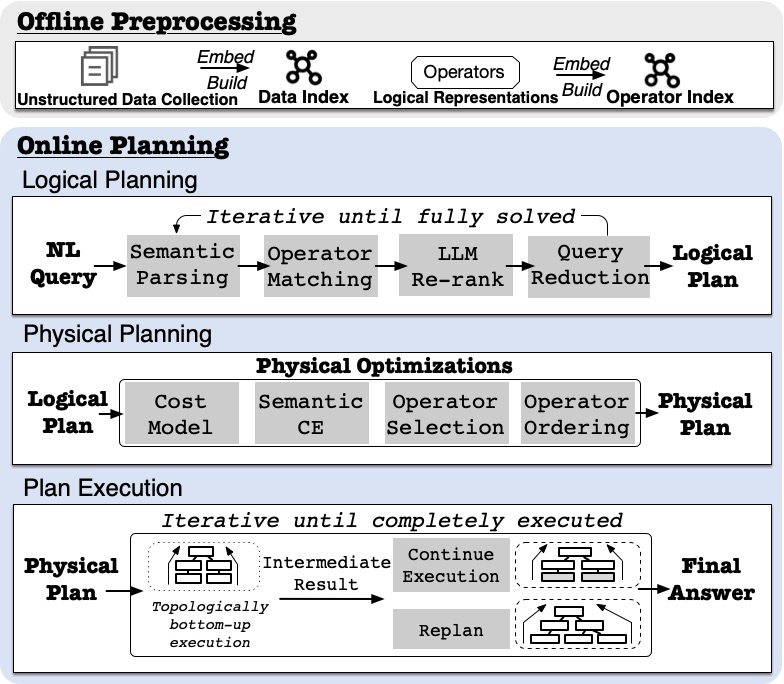
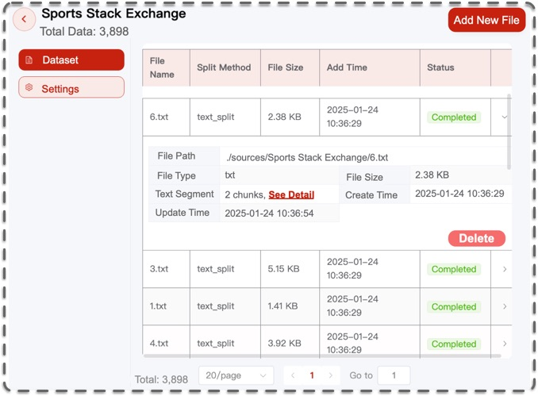
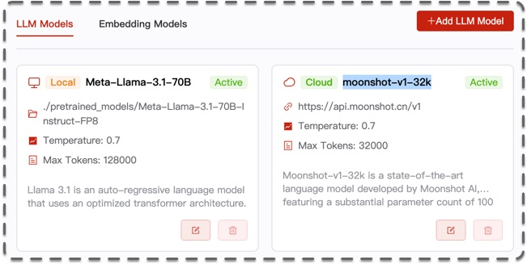
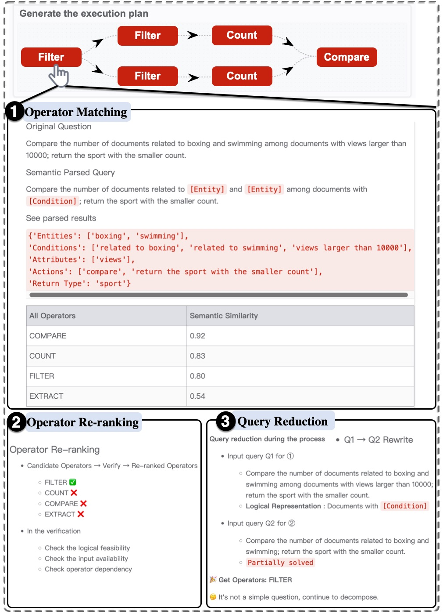
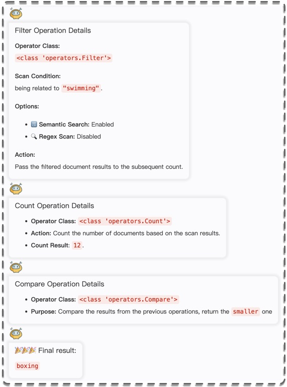

# 📰 Unify: A System for Unstructured Data Analytics

<p align="center">
  <b>📃 This is the prototype implementation of the Unify system. 🎈</b>
</p>

<div align="center">
  
  <a></a>
  <a></a>
  <a></a>
  [![Contributors][contributors-shield]][contributors-url]
  [![Issues][issues-shield]][issues-url]
  [![MIT License][license-shield]][license-url]

</div>

<p align="center">
  <a href="https://github.com/TsinghuaDatabaseGroup/Unify/">
    
  </a>
  <h3 align="center">An Unstructured Data Analytics System</h3>


Unify processes natural language data analytics queries over unstructured documents leveraging LLMs.
It **systematically breaks down queries into manageable sub-queries, matching them with predefined operators to produce accurate results efficiently**.

Unify utilizes large language models (LLMs) to automatically ***generate, optimize, and execute*** queries written in natural language. 
The system decomposes queries into smaller steps, identifies the most relevant operators, and optimizes execution plans using a semantic cost model.
The plan will the be executed efficiently to obtain the final results.


## 📖 Contents

- [📰 Unify](#-unify)
  - [📖 Contents](#-contents)
  - [📚 Folder Structure](#-folder-structure)
  - [🚀 Quick Start](#-quick-start)
    - [⚙ Environment Setup](#-environment-setup)
    - [🛠 Run the Query Answering Process](#-run-the-query-answering-process)
  - [📜 Architecture of Unify](#-architecture-of-unify)
  - [🖥 Demo](#-demo)
  - [📝 Todo](#-todo)
  - [✨ Contributors](#-contributors)
  - [📌 Citation](#-citation)


## 📚 Folder Structure

    ./main
    ├── /chunk                # Text chunking for embedding and indexing
    ├── /data                 # Dataset processing
    ├── /embed                # Data embedding for indexing and matching
    ├── /index                # Vector indexing for efficient data retrieval
    ├── /knowledge_base       # knowledgebase for BQ reduce
    ├── /operators            # Physical operator implementations
    ├── /prompts              # Common prompt templates for LLM interactions
    ├── /semanticParse        # Logical representations of the operators and matching logic
    ├── /utils                # LLM config and other utils
    ├── API.py                # Back-end encapsulation API
    ├── PlanManager.py        # Execution plan manager for query processing
    ├── run.sh                # bash command for running
    └── unify.py              # Main script to load queries, generate plans, and execute them

## 🚀 Quick Start
             
### ⚙ Environment Setup

**1. Backend Environment Setup**

First, ensure your python version is `3.10` or later.
```python
$ python --version
Python 3.10.16
```

Next, create a virtual environment and install the project dependencies according to [`requirements.txt`](requirements.txt). Some key dependencies include:
- `vllm==0.5.3`
- `torch==2.3.1`
- `openai==1.37.0`
- `hnswlib==0.8.0`
- `sentence-transformers==2.5.0`

The bash command are as follows:
```Shell
# Clone the repository
$ git clone https://github.com/TsinghuaDatabaseGroup/Unify.git

# Enter the directory
$ cd Unify

# Create virtual environment using conda
conda create -n unify python=3.10 [anaconda] #This is an option, if use, remove the square brackets. It will help you install some commonly used package

# Activate the environment
conda activate unify

# Install dependencies
$ pip install -r requirements.txt
```
🔔 Datasets and queries can be downloaded from [this Google Drive link](https://drive.google.com/drive/folders/1K69FGBb77piIsjKdYPO9xbvPhXg9yDyd?usp=drive_link).

**2. Download LLM Model and Embedding Model from [HuggingFace](https://huggingface.co/models) / [modelscope](https://modelscope.cn/models)**

To download the model, you need to install [Git LFS](https://docs.github.com/zh/repositories/working-with-files/managing-large-files/installing-git-large-file-storage) first, then run:

```Shell
# Make sure git-lfs is installed (https://git-lfs.com)
$ git lfs install

# When prompted for a password, use an access token with write permissions.
# Generate one from your settings: https://huggingface.co/settings/tokens
$ git clone https://huggingface.co/RedHatAI/Llama-3.1-70B-FP8
$ git clone https://huggingface.co/meta-llama/Llama-3.1-8B #optional
$ git clone https://huggingface.co/heilerich/llama-tokenizer-fast #tokenizer model
$ git clone https://huggingface.co/sentence-transformers/all-MiniLM-L6-v2 #embedding model
```

After downloading the model:

1. **Configure Model Paths and Ports**

  Update the model paths and verify that the specified ports for LLMs are correctly set.

  **Note**: For running experiments, Llama models are used as local LLMs, served on designated ports.
  - **Llama-3.1-70B-FP8** deployed on port `8001`
  - **Llama-3.1-8B** deployed on port `8002`

2. **Start Local LLM Servers**

  Use `vllm` to start the LLM server on the assigned ports. For example, to start Llama-3.1-70B-FP8, run:

  ```bash
  CUDA_VISIBLE_DEVICES=0,1,2,3 vllm serve {MODEL_PATH}/Meta-Llama-3.1-70B-Instruct-FP8   --max-model-len 80000 --port 8001 --tensor-parallel-size 4  --gpu-memory-utilization 0.85
  ```

**3. Hardware Environment**

Experiments were conducted on an Ubuntu server with an `Intel Xeon 6242R CPU`, `6 Nvidia 4090 GPUs`, and `2TB RAM`.

### 🛠 Run the Query Answering Process

   Execute `unify.py` to process queries over the documents and obtain results.

```bash
# Enter the directory
$ cd ./main

#To run unify, you should specify the path of your LLM, tokenizer and embeded model first
#--doc_path is the path of your document set

$ python unify.py --llm_model_path /path/to/llm --tokenizer_path /path/to/tokenizer --sentence_model_path /path/to/sentence_model --doc_path /path/to/docs --query /your/query

#or run run.sh directly
$ bash run.sh
```


## 📜 Architecture of Unify

<p align="center">

</p>

As shown in the architecture figure, Unify consists of the following modules: operator management, index construction, logical plan generation, physical plan optimization and interactive plan execution. 
Unify generates logical plans to ensure correct reasoning, transforms logical plans into optimized physical plans for efficiency and executes the plans to compute the final results.

## 🖥 Demo

We are constructing an online demo, and it will be released in the near future. If you want to debug the front end by yourself, you can refer to branch [demo](https://github.com/TsinghuaDatabaseGroup/Unify/tree/demo) (We will update the upload soon).

Here, we give a brief demonstration:


- **1. Data Management**
<p align="center">
  
</p>

- **2. Model Management**
<p align="center">
  
</p>

- **3. An example plan generation process**
<p align="center">
  
</p>

- **4. An example plan execution process**
<p align="center">
  
</p>


## 📝 Todo

- **Online Demo Release**: We are currently constructing an online demo, and intend to release it in the near future.
-  **Plan generation efficiency**: We plan to enhance the efficiency of plan generation by minimizing the invocation of LLMS as much as possible or by using smaller-sized models.
-  **Plan exection accuracy**: We aim to improve the efficiency and accuracy of plan execution by optimizing physical operators.

## ✨ Contributors

<!-- <a href="https://github.com/TsinghuaDatabaseGroup/Unify/network/dependencies">
   -->
</a>

<a href="https://dbgroup.cs.tsinghua.edu.cn/ligl/">Guoliang Li</a>, 
<a href="https://for0nething.github.io/">Jiayi Wang</a>, 
<a href="https://github.com/Macly-DB">Yuan Li</a>

## 📌 Citation
Feel free to cite us if you like this project.

```bibtex
@inproceedings{wang2025unify,
  title={Unify: An unstructured data analytics system},
  author={Wang, Jiayi and Feng, Jianhua},
  booktitle={2025 IEEE 41st International Conference on Data Engineering (ICDE)},
  year={2025},
}
```


This project is licensed under the MIT License - see the [LICENSE](LICENSE) file for details


[contributors-shield]: https://img.shields.io/github/contributors/TsinghuaDatabaseGroup/Unify.svg?style=flat-square
[contributors-url]: https://github.com/TsinghuaDatabaseGroup/Unify/graphs/contributors
[issues-shield]: https://img.shields.io/github/issues/TsinghuaDatabaseGroup/Unify.svg?style=flat-square
[issues-url]: https://img.shields.io/github/issues/TsinghuaDatabaseGroup/Unify.svg
[license-shield]: https://img.shields.io/github/license/TsinghuaDatabaseGroup/Unify.svg?style=flat-square
[license-url]: https://github.com/TsinghuaDatabaseGroup/Unify/blob/main/LICENSE
